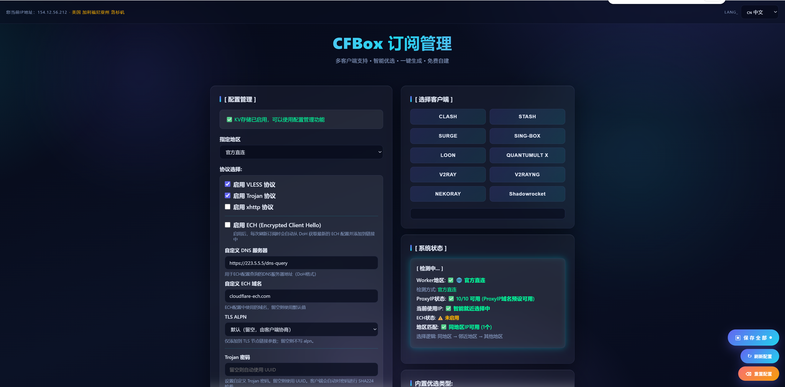
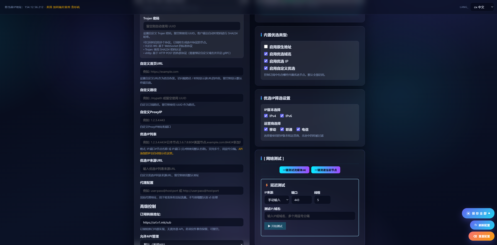
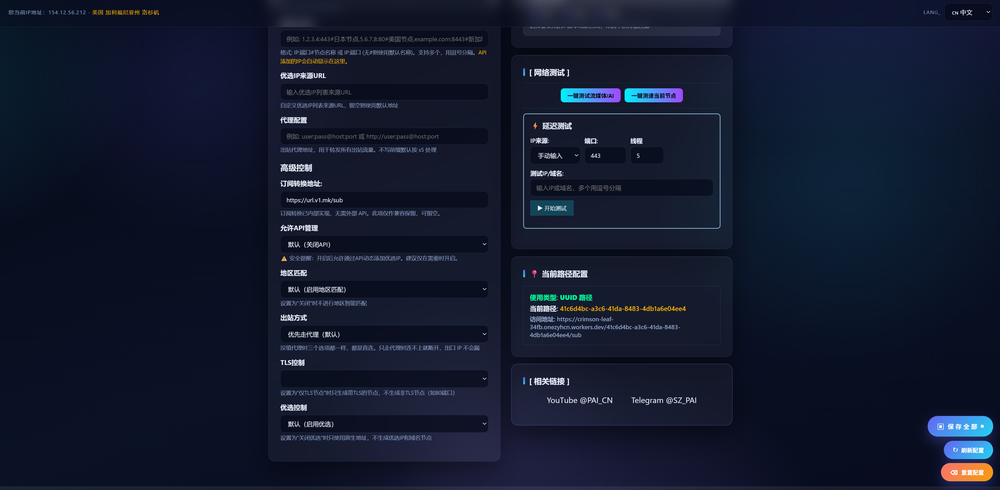

# مدیر اشتراک CFBox

> **یک پنل مدیریت اشتراک پراکسی که روی Cloudflare Workers اجرا می‌شود و با هر دو پروژه CFnew و edgetunnel سازگار است** — علاوه بر ارائه اشتراک‌های چندپروتکلی VLESS/Trojan/xhttp در مسیر `/UUID`، رابط پیکربندی گرافیکی (مبتنی بر KV، اعمال تغییرات به‌صورت فوری) را فراهم می‌کند و شامل تست تأخیر، بررسی اتصال استریم/هوش مصنوعی، تولید اشتراک چندکلاینتی و پشتیبانی چندزبانه است.

---
> **[گروه تلگرام](https://t.me/SZ_PAI)**
> **[کانال یوتیوب](https://www.youtube.com/@PAI_CN)**
---



---

## فهرست مطالب

- [۱. نمای کلی پروژه و سازگاری](#۱-نمای-کلی-پروژه-و-سازگاری)
- [۲. امکانات اصلی](#۲-امکانات-اصلی)
- [۳. روش استقرار](#۳-روش-استقرار)
- [۴. متغیرهای محیطی و جدول پیکربندی](#۴-متغیرهای-محیطی-و-جدول-پیکربندی)
- [۵. حاشیه‌نویسی ساختار کد](#۵-حاشیهنویسی-ساختار-کد)
- [۶. شرح امکانات](#۶-شرح-امکانات)
- [۷. عملکرد و امنیت](#۷-عملکرد-و-امنیت)
- [۸. قدردانی](#۸-قدردانی)

---

## ۱. نمای کلی پروژه و سازگاری

| مورد | محتوا |
|---|---|
| نام پروژه | **مدیر اشتراک CFBox** (ترمینال v1.0) |
| محیط اجرا | Cloudflare Workers / Pages (رانتایم سازگار با Node؛ تاریخ سازگاری پیشنهادی `2026-01-20`) |
| روش استقرار | فایل تک‌کاربره Worker (نسخه متنی / نسخه مبهم‌سازی‌شده) |
| ذخیره‌سازی داده | Cloudflare KV (متغیر متصل **K**، سازگار با C/KV/ConfigKV/CFKV/CFBOX) |

### ۱.۱ سازگاری کامل با IP / نودهای هر دو پروژه CFnew و edgetunnel

> CFBox در زمان تولید اشتراک، منابع IP/نود هر دو پروژه CFnew و edgetunnel (cmliu) را یکپارچه و ادغام می‌کند — IPهای هر دو سیستم به‌صورت بومی پشتیبانی می‌شوند و می‌توانند هم‌زمان استفاده شوند.

**جدول سازگاری**

| منبع | پیاده‌سازی در CFBox | موقعیت در کد |
|---|---|---|
| **IPهای CFnew** | ① فهرست دامنه‌های برگزیده به‌صورت اصلی داخلی‌سازی شده: `cloudflare.182682.xyz`، `speed.marisalnc.com`، `freeyx.cloudflare88.eu.org`، `bestcf.top`<br>② برگزیده آنلاین از همان اندپوینت cfnew یعنی `wetest.vip` (IPv4/IPv6 فیلترشده بر اساس ISP)<br>③ `yx` برگزیده سفارشی کاملاً از قالب `IP:پورت#نام` پروژه cfnew استفاده می‌کند<br>④ سیستم سوییچ `epd` / `epi` / `egi` / `ena` همانند cfnew است | **L271 فهرست دامنه‌های مستقیم**<br>**L2959 دریافت IP برگزیده**<br>**L662-694 تحلیل yx** |
| **IPهای edgetunnel (cmliu)** | ① استخر دامنه‌های پراکسی معکوس **ProxyIP** متعلق به cmliu به‌صورت کامل داخلی‌سازی شده: `ProxyIP.HK/US/SG/JP/KR/DE/SE/NL/FI/GB/Oracle/DigitalOcean/Vultr/Multacom...CMLiussss.net` به‌عنوان آدرس ذخیره/رله<br>② زنجیره بازگشت `GO2SOCKS5` / SOCKS5 سازگار با edgetunnel<br>③ فهرست‌های ساده `IP:پورت` به‌سبک edgetunnel را می‌توان مستقیماً به `yx` داد یا از طریق `yxURL` دریافت کرد | **L200-270 فهرست آدرس‌های ذخیره**<br>**L5 GO2SOCKS5** |

**منطق ادغام در تولید اشتراک (L2654-2680)**

```
فهرست نهایی نودها =
    برگزیده سفارشی (yx)         ← افزوده‌شده دستی/API، IP:پورت#نام
  + فهرست دامنه‌های برگزیده     ← دامنه‌های مستقیم cfnew (epd)
  + برگزیده آنلاین wetest       ← همان اندپوینت cfnew (epi، فیلتر ISP)
  + برگزیده مخزن GitHub (egi)
  + فهرست پراکسی معکوس ProxyIP  ← edgetunnel (cmliu)، به‌عنوان رله/ذخیره
```

همه منابع ادغام و با هم خروجی داده می‌شوند؛ IPv4 / IPv6 / دامنه / نام‌های مستعار `#نام` همگی پشتیبانی می‌شوند.

**توضیحات**

«ناسازگاری» بین دو پروژه معمولاً مشکل فرمت نیست، بلکه **تفاوت URL منبع IP برگزیده** (cfnew از `wetest.vip` استفاده می‌کند، edgetunnel از استخر IP خودش) یا **تفاوت مالکیت دامنه ProxyIP** است. CFBox همه این منابع را یکپارچه کرده و دیگر تداخلی رخ نمی‌دهد.

- **سیستم سوییچ CFnew**: `epd` (دامنه برگزیده) / `epi` (IP برگزیده) / `egi` (برگزیده مخزن) / `ena` (آدرس بومی)
- **مکانیزم‌های edgetunnel**: پراکسی معکوس `ProxyIP.*.CMLiussss.net` + بازگشت `GO2SOCKS5`/SOCKS5
- اگر همچنان نود خاصی متصل نمی‌شود، لینک اشتراک آن نود یا URL منبع IP برگزیده را برای بررسی ارسال کنید.

---

## ۲. امکانات اصلی

| # | امکانات | موقعیت در کد (بخش) |
|---|---|---|
| 1 | **پشتیبانی چندپروتکلی**: VLESS / Trojan / xhttp، امکان فعال‌سازی هم‌زمان | پردازش اشتراک / هسته پراکسی WebSocket |
| 2 | **مسیر سفارشی**: استفاده از مسیر سفارشی به‌جای مسیر UUID (پشتیبانی از چندسطحی) | مسیریابی / صفحه ورود |
| 3 | **تست تأخیر**: ابزار سرعت‌سنج داخلی، اندازه‌گیری تأخیر IP برگزیده، دریافت خودکار کد فرودگاه | منطق فرانت‌اند پنل |
| 4 | **تست شبکه**: تست یک‌کلیکی استریم/هوش مصنوعی (Google/Netflix/Disney+/HBO/HBOMax/Peacock/GitHub/GPT/Gemini) + تست سرعت یک‌کلیکی نود فعلی (fiber.google.com) | منطق فرانت‌اند پنل / API تست شبکه |
| 5 | **تبدیل اشتراک**: آدرس سرویس تبدیل اشتراک سفارشی (`scu`) | پردازش اشتراک |
| 6 | **پیکربندی گرافیکی**: پیکربندی مبتنی بر KV، اعمال فوری (متصل به **K**) | پنل مدیریت / منطق فرانت‌اند پنل |
| 7 | **مدیریت API**: افزودن/حذف RESTful آی‌پی برگزیده (`/api/preferred-ips`) | مسیریابی / پنل |
| 8 | **چندکلاینتی**: CLASH / SURGE / SING-BOX / LOON / QUANTUMULT X / V2RAY / Shadowrocket / STASH / NEKORAY / V2RAYNG، شناسایی خودکار بر اساس UA | تولید چندکلاینتی / پردازش اشتراک |
| 9 | **چندزبانه**: 中文 / فارسی / English، تعویض خودکار بر اساس زبان مرورگر + منوی کشویی | صفحه ورود / پنل مدیریت |
| 10 | **نمایش منطقه IP فعلی**: بالا-چپ «آدرس IP فعلی شما: IP · منطقه»، تشخیص منطقه از طریق ping0.cc | صفحه ورود / HUD پنل |
| 11 | **ECH**: Encrypted Client Hello | بخش ECH |
| 12 | **پارامترهای مسیر کلاینت**: `p` / `wk` / `rm` / `s` بازنویسی سطح نود | هسته پراکسی WebSocket |

---

## ۳. روش استقرار

### استقرار در Worker

1. وارد داشبورد Cloudflare شوید ← Workers & Pages ← ایجاد Worker
2. کد `CFBox明文版.js` (یا نسخه مبهم‌سازی‌شده) را در کد Worker قرار دهید
3. **متغیر محیطی `U`** را = UUID خود تنظیم کنید (الزامی؛ U بزرگ، u کوچک نیز سازگار است)
4. یک **فضای نام KV** بسازید و در تنظیمات Worker متصل کنید، نام متغیر **`K`** (اصلی؛ سازگار با `C`/`KV`/`ConfigKV`/`CFKV`/`CFBOX`)
5. **تاریخ سازگاری** را روی `2026-01-20` تنظیم کنید
6. پس از استقرار، برای ورود به پنل پیکربندی گرافیکی از `https://دامنه-شما/UUID` بازدید کنید

### استقرار در Pages

1. وارد داشبورد Cloudflare شوید ← Workers & Pages ← ایجاد پروژه Pages
2. فایل `CFBox明文版.js` (یا نسخه مبهم‌سازی‌شده) را به `.zip` فشرده کنید → فایل `.zip` را آپلود کنید
3. **متغیر محیطی `U`** را = UUID خود تنظیم کنید (الزامی؛ U بزرگ، u کوچک نیز سازگار است)
4. یک **فضای نام KV** بسازید و در تنظیمات Pages متصل کنید، نام متغیر **`K`** (اصلی؛ سازگار با `C`/`KV`/`ConfigKV`/`CFKV`/`CFBOX`)
5. دوباره فایل `.zip` را آپلود کنید
6. **تاریخ سازگاری** را روی `2026-01-20` تنظیم کنید
7. پس از استقرار، برای ورود به پنل پیکربندی گرافیکی از `https://دامنه-شما/UUID` بازدید کنید

### جریان ورود

بازدید از `/` → صفحه ورود ترمینال → وارد کردن UUID (یا مسیر سفارشی) → «ورود موفق» → ورود به پنل.

---

## ۴. متغیرهای محیطی و جدول پیکربندی

> اولویت: **پیکربندی KV > متغیرهای محیطی > مقادیر پیش‌فرض** (مطابق منطق «جمع‌آوری اسنپ‌شات پیکربندی» در کد).

### ۴.۱ پیکربندی پایه

| متغیر | مقدار | توضیحات | فیلد در کد |
|---|---|---|---|
| `U` | UUID شما | **الزامی**، برای دسترسی به اشتراک و رابط پیکربندی (U بزرگ، u کوچک / UUID سازگار) | `认证令牌` |
| `p` | proxyip | اختیاری، آدرس و پورت ProxyIP سفارشی (IPv4/IPv6/دامنه). پس از تنظیم، تطبیق منطقه `wk` غیرفعال می‌شود (متقابل). همچنین می‌توان در مسیر نود مشخص کرد | `获取配置值('p')` |
| `s` | آدرس SOCKS5 | اختیاری، `user:pass@host:port` یا `host:port`. همچنین می‌توان در مسیر نود مشخص کرد | `代理5配置` |
| `d` | مسیر سفارشی | اختیاری، مانند `/mypath` یا `/path/to/sub`؛ در صورت خالی بودن، از مسیر UUID استفاده می‌شود | `自定义路径` |
| `wk` | کد منطقه | اختیاری، تعیین دستی منطقه Worker (SG/HK/US/JP…). پس از تنظیم `p` غیرفعال می‌شود (متقابل) | `手动工作器地区` |

### ۴.۲ پیکربندی پروتکل

| متغیر | مقدار | توضیحات | فیلد در کد |
|---|---|---|---|
| `ev` | yes/no | فعال‌سازی VLESS (پیش‌فرض فعال) | `启用明文` |
| `et` | yes/no | فعال‌سازی Trojan (پیش‌فرض غیرفعال) | `启用木马` |
| `ex` | yes/no | فعال‌سازی xhttp (پیش‌فرض غیرفعال) | `启用扩展传输` |
| `tp` | رمز سفارشی | رمز Trojan؛ در صورت خالی، از UUID استفاده می‌شود | `配置默认值.tp` |
| `ech` | yes/no | فعال‌سازی ECH (پیش‌فرض غیرفعال؛ با فعال‌سازی، حالت فقط-TLS خودکار روشن می‌شود) | `启用加密客户端问候` |

### ۴.۳ کنترل‌های پیشرفته

| متغیر | مقدار | توضیحات | فیلد در کد |
|---|---|---|---|
| `yx` | برگزیده سفارشی | پشتیبانی از نام‌گذاری، `1.1.1.1:443#香港节点,8.8.8.8:53#Google DNS` | `自定义优选地址列表` |
| `yxURL` | URL منبع برگزیده | منبع فهرست IP سفارشی؛ در صورت خالی، از پیش‌فرض استفاده می‌شود | `优选地址源` |
| `scu` | آدرس تبدیل اشتراک | پیش‌فرض `https://url.v1.mk/sub` | `订阅转换接口` |
| `epd` | yes/no | فعال‌سازی دامنه برگزیده (پیش‌فرض فعال) | `启用优选域名` |
| `epi` | yes/no | فعال‌سازی IP برگزیده (پیش‌فرض فعال) | `启用优选地址` |
| `egi` | yes/no | فعال‌سازی برگزیده پیش‌فرض GitHub (پیش‌فرض فعال) | `启用仓库优选` |
| `ena` | yes/no | فعال‌سازی آدرس بومی (پیش‌فرض غیرفعال) | `启用原生地址` |
| `qj` | no | تنظیم روی `no` برای فعال‌سازی بازگشت: مستقیم CF → SOCKS5 → fallback | `启用代理降级` |
| `dkby` | yes | تنظیم روی `yes` برای تولید نودهای فقط-TLS | `禁用非传输层安全` |
| `yxby` | yes | تنظیم روی `yes` برای غیرفعال‌سازی همه امکانات برگزیده | `禁用优选` |
| `rm` | no | تنظیم روی `no` برای غیرفعال‌سازی تطبیق هوشمند منطقه | `启用地区匹配` |
| `ae` | yes | تنظیم روی `yes` برای مجاز بودن مدیریت API (پیش‌فرض غیرفعال) | `配置默认值.ae` |

> **سفارشی‌سازی اختصاصی CFBox**: فیلتر IP برگزیده (`ipv4` / `ipv6` / `ispMobile` / `ispUnicom` / `ispTelecom`)، DNS سفارشی (`customDNS`، قالب DoH)، دامنه ECH سفارشی (`customECHDomain`)، مذاکره ALPN (`alpn`) و غیره — همه در ماژول‌های «برگزیده داخلی» و «فیلتر IP برگزیده» پنل قابل پیکربندی هستند (پس از اتصال KV نمایش داده می‌شوند).

### ۴.۴ تنظیم ذخیره‌سازی KV

1. یک فضای نام KV در Cloudflare Workers بسازید
2. KV را متصل کنید، نام متغیر **`K`** (سازگار با `C`/`KV`/`ConfigKV`/`CFKV`/`CFBOX`)
3. دوباره استقرار دهید
4. برای استفاده از پیکربندی گرافیکی از `/{UUID}` بازدید کنید (اعمال فوری، بدون نیاز به استقرار مجدد)

---

## ۵. حاشیه‌نویسی ساختار کد

> در زیر کد از بالا به پایین به بخش‌های عملکردی تقسیم شده و مسئولیت هر بخش توضیح داده می‌شود. شماره خطوط به خطوط شروع در `CFBox明文版.js` اشاره دارد.

### ۵.۱ متغیرهای سراسری زمان اجرا (L4 ~ L40)

```js
// توکن احراز هویت: UUID خوانده‌شده از متغیر محیطی U، برای احراز هویت اشتراک و پنل
// لیست سفید GO2SOCKS5 / آدرس بازگشت / پیکربندی پروکسی5: زنجیره بازگشت (مستقیم CF→SOCKS5→fallback)
// فهرست آدرس/دامنه برگزیده سفارشی: توسط متغیر yx و IPهای برگزیده افزوده‌شده با API پر می‌شود
// سوییچ‌های امکانات: متن(ev)/تروجان(et)/xhttp(ex)/ECH(ech)/بازگشت(qj)/فقط-TLS(dkby)/
//                    غیرفعال‌سازی برگزیده(yxby)/تطبیق منطقه(rm)/فعال‌سازی بومی(ena)
// منطقه و مسیر: منطقه Worker(wk)/مسیر سفارشی(d)
// سوییچ‌های برگزیده: دامنه برگزیده(epd)/IP برگزیده(epi)/برگزیده مخزن(egi)
// KV: اتصال ذخیره‌سازی کلید-مقدار (متغیر K)، کش پیکربندی (کش حافظه ۳۰ ثانیه‌ای، کاهش خواندن KV)
```

### ۵.۲ جدول مقادیر پیش‌فرض پیکربندی (L42 ~ L74)

آبجکت مقدار پیش‌فرض کد متناظر با جداول متغیر «پایه/پروتکل/پیشرفته» در README:

- `wk` (منطقه)، `ev/et/ex` (سوییچ‌های پروتکل)، `ech`، `tp` (رمز Trojan)
- `customDNS` (DoH)، `customECHDomain` (دامنه ECH)، `alpn`
- `d/p/s` (مسیر/ProxyIP/SOCKS5)، `yx/yxURL/scu`
- `ena/epd/epi/egi` (بومی/دامنه/IP/برگزیده مخزن)، `ae/rm/qj/dkby/yxby`
- فیلتر IP برگزیده: `ipv4/ipv6/ispMobile/ispUnicom/ispTelecom`

### ۵.۳ توابع کمکی پیکربندی (L75 ~ L170)

- **عادی‌سازی سوییچ**: `是否开启值/归一配置开关/获取配置开关值` — یکپارچه‌سازی `yes/no/true/false/1/0/on/off` به بولی
- **خواندن متغیر محیطی**: `读取环境配置值/获取环境配置快照` — پشتیبانی از **نام متغیر بزرگ/کوچک** (مانند `U/u`، `K/k`، رفع باگ بزرگی/کوچکی حروف)
- **جمع‌آوری اسنپ‌شات پیکربندی**: `整理有效配置/获取有效配置快照` — ادغام با اولویت «پیش‌فرض → متغیر محیطی → KV»؛ تضمین فعال بودن حداقل یک پروتکل (در صورت خاموش بودن همه ev/et/ex، به‌صورت خودکار ev فعال می‌شود)

### ۵.۴ جدول نگاشت کد فرودگاه (L172 ~ L190)

`地区映射`: تست تأخیر/نودهای برگزیده به‌صورت خودکار کد فرودگاه (SJC/LAX و غیره) را دریافت و به نام چینی نگاشت می‌کنند (سَن‌خوزه و غیره)، برای شناسایی برچسب فرودگاه/دیتاسنتر آدرس‌های برگزیده.

### ۵.۵ دریافت آدرس مستقیم رسمی / برگزیده (L191 ~ L315)

`取官方直连地址()`: فهرست داخلی دامنه‌ها و IPهای برگزیده رسمی Cloudflare (با برچسب فرودگاه/منطقه) برای تولید نود؛ ادغام همه منابع برگزیده از طریق سوییچ‌های `epd/epi/egi`؛ پشتیبانی `yx` از نام‌گذاری سفارشی «IP:پورت#نام» (مطابق README «نام‌گذاری نود برگزیده»).

### ۵.۶ کدهای خطای پروتکل پراکسی و ثابت‌ها (L316 ~ L360)

پیام‌های خطای استفاده‌شده در دست‌دهی VLESS / Trojan / SOCKS5 / تونل HTTP (`错误_无效数据`، `错误_代理连接失败` و غیره) و ثابت‌های متن پروتکل (`文本_连接方法`CONNECT، `文本_代理认证头`Proxy-Authorization، نسخه‌های HTTP و غیره).

### ۵.۷ ابزارهای تحلیل و نام‌گذاری نود + خواندن/نوشتن KV (L361 ~ L602)

- شماره‌گذاری یکتای نود (`创建节点命名器/设置跳过编号/处理命名器`)
- تحلیل نام مستعار «IP:پورت#نام» (`处理值节点别名部分/获取值节点别名基础`)
- عادی‌سازی مقدار مذاکره ALPN (`规范化应用层协议协商`، h3,h2,http/1.1)
- **خواندن/نوشتن پیکربندی KV** (`加载键值配置/保存键值配置`): متغیر متصل K، کش حافظه ۳۰ ثانیه‌ای؛ دریافت/تنظیم مقدار پیکربندی (`获取配置值/设置配置值`)
- بررسی در دسترس بودن آدرس (`检查地址可用性`)، انتخاب ProxyIP/تطبیق منطقه (`获取值备用地址/获取值地区值`: همان منطقه → مجاور → سایر)

### ۵.۸ مسیریابی fetch ورودی اصلی Worker (L604 ~ L1080)

```js
export default { async fetch(请求, 环境, ...) }
```

- ابتدا UUID اعتبارسنجی می‌شود (بدون حساسیت به بزرگی/کوچکی حروف، سازگار با `U/u`)
- مسیریابی:
  - **POST / ارتقا WebSocket** → درخواست پراکسی (تحلیل و ارسال پروتکل VLESS/Trojan)
  - **GET /** → صفحه ورود ترمینال
  - **GET /{UUID یا مسیر سفارشی}** → پنل مدیریت (پیکربندی گرافیکی)
  - **GET /{UUID یا مسیر}/sub...** → خروجی اشتراک (شناسایی خودکار کلاینت بر اساس User-Agent)
  - **/api/preferred-ips** → مدیریت API (پرس‌وجو/افزودن/حذف IP برگزیده)
  - **/region** → API تشخیص منطقه Worker
  - **/net-test** → API تست شبکه (اتصال استریم/هوش مصنوعی، سفارشی CFBox)

### ۵.۹ صفحه ورود ترمینال (L1081 ~ L1545)

- پس از استقرار، بازدید از `/` صفحه ورود ترمینال را نشان می‌دهد؛ با وارد کردن UUID (یا مسیر سفارشی) وارد پنل می‌شوید
- پشتیبانی از 中文 / فارسی / English، انتخاب خودکار بر اساس زبان مرورگر
- HUD بالایی آدرس IP فعلی بازدیدکننده (`访客IP`، از CF-Connecting-IP) + منطقه (تشخیص از طریق JSONP پینگ۰) را نشان می‌دهد
- اسکریپت‌های صفحه ورود: افکت باران ماتریسی سایبر (قابل غیرفعال‌سازی دائمی از طریق سوییچ FX)، اعتبارسنجی قالب UUID (RFC4122)، تعویض زبان پایدار (localStorage + Cookie، اعتبار ۱ سال)

### ۵.۱۰ تولید اشتراک چندکلاینتی (L1634 ~ L2456)

مطابق README «پشتیبانی چندکلاینتی»:

- تحلیل لینک اشتراک (`解析值链接`): تحلیل `vless://`، `trojan://` به آبجکت نود (پروتکل، آدرس، پورت، SNI، اثرانگشت، نوع انتقال، مسیر، Host)
- تولیدکننده‌های قالب کلاینت:
  - `生成值值589` → **Clash / Mihomo** YAML (مجموعه قوانین کامل + rule-providerهای از راه دور + DNS)
  - `生成值值562` → **Surge / Stash** ini
  - `生成值值552` → **Loon** ini
  - `生成值值` → **Quantumult X** (منابع فیلتر از راه دور)
  - `生成值值数据对象` → **SING-BOX** JSON
  - سایر → اشتراک‌های Base64 مانند V2RAY / NEKORAY / Shadowrocket
- همه لینک‌های TLS به‌صورت خودکار شامل مذاکره پروتکل `h3,h2,http/1.1` هستند

### ۵.۱۱ ECH (L2460 ~ L2592)

مطابق README «ECH»: `获取加密客户端问候配置()` — دریافت آخرین پیکربندی ECH از DoH در هر بار به‌روزرسانی اشتراک؛ اولویت با Google DNS، در صورت خطا بازگشت خودکار به Cloudflare DNS؛ فعال‌سازی ECH به‌صورت خودکار حالت فقط-TLS را فعال می‌کند (جلوگیری از تداخل پورت ۸۰)؛ اطلاعات دیباگ از طریق هدرهای پاسخ `X-ECH-Status` / `X-ECH-Debug` / `X-ECH-Config-Length` بازگردانده می‌شود.

### ۵.۱۲ پردازش درخواست اشتراک (L2593 ~ L2958)

`处理订阅请求()` فهرست نهایی نودهای اشتراک را جمع‌آوری و تولید می‌کند:

- مستقیم رسمی + دامنه/IP برگزیده/مخزن GitHub (مطابق `epd/epi/egi`)
- برگزیده سفارشی `yx` و IPهای برگزیده افزوده‌شده با API به‌صورت خودکار ادغام می‌شوند
- VLESS / Trojan / xhttp بر اساس سوییچ‌هایشان تولید می‌شوند
- تطبیق منطقه Worker بهترین ProxyIP را انتخاب می‌کند (همان منطقه → مجاور → سایر)
- برگزیده خودکار هر ۱۵ دقیقه؛ در صورت خطای دریافت، نود خطای جایگزین بازگردانده می‌شود
- بر اساس پارامتر `target` یا User-Agent، قالب مناسب کلاینت بازگردانده می‌شود

### ۵.۱۳ دریافت فهرست IP برگزیده (L2959 ~ L3033)

`获取值地址列表()`: دریافت آدرس‌های برگزیده IPv4/IPv6 از اندپوینت برگزیده آنلاین (wetest.vip)، فیلتر بر اساس تنظیمات «فیلتر IP برگزیده» (ipv4/ipv6/موبایل/یونیکام/تلکام) و تحلیل فیلدهای آدرس/پورت/فرودگاه/منطقه برای تولید نود.

### ۵.۱۴ هسته پراکسی WebSocket (L3034 ~ L3947)

دست‌دهی پروتکل و ارسال داده VLESS / Trojan / xhttp:

- تحلیل پارامترهای مسیر کلاینت (README «پارامترهای مسیر کلاینت»): `p`=بازنویسی ProxyIP / `wk`=بازنویسی منطقه / `rm`=غیرفعال‌سازی تطبیق منطقه / `s`=بازنویسی SOCKS5
- **اولویت: پارامتر مسیر > KV/متغیر محیطی > تشخیص خودکار**
- اتصال رقابتی چندگانه (`连接值套接字`، Promise.any) + تلاش مجدد و بازگشت در صورت خطا (مستقیم CF → SOCKS5 → fallback)
- ارسال UDP(DNS)، صف بسته‌ها و کنترل فشار

### ۵.۱۵ پراکسی تونل SOCKS5 / HTTP (L3714 ~ L3947)

مطابق README «حالت بازگشت» و متغیر `s`: `处理值代理连接()` — تحلیل `s` (user:pass@host:port یا host:port) برای برقراری پراکسی؛ پشتیبانی از دست‌دهی احراز هویت SOCKS5، تونل CONNECT و ارسال CONNECT؛ به‌عنوان زنجیره بازگشت پس از خطای اتصال مستقیم CF استفاده می‌شود.

### ۵.۱۶ پنل مدیریت (L3948 ~ L5200)

`处理订阅值()` HTML پنل مدیریت را می‌سازد (رشته قالب):

- HUD بالایی: IP فعلی + منطقه (ping0.cc) + منوی کشویی تعویض زبان
- چیدمان دو ستونه:
  - **چپ**: مدیریت پیکربندی (پس از اتصال KV نمایش داده می‌شود)
  - **راست**: انتخاب کلاینت / وضعیت سیستم / پیکربندی مسیر فعلی / برگزیده داخلی / فیلتر IP برگزیده / تست شبکه / لینک‌های مرتبط
- وضعیت سیستم: منطقه Worker، روش تشخیص، ProxyIP، IP فعلی
- دیکشنری‌های چندزبانه (中文/فارسی/English)

### ۵.۱۷ منطق فرانت‌اند پنل (L5201 ~ L8814)

`<script>` داخل صفحه:

- پس از عبور از بررسی اتصال KV (متغیر K)، محتوای مدیریت پیکربندی نمایش داده می‌شود (`configContent`، برگزیده داخلی، ماژول‌های فیلتر IP برگزیده)
- بارگذاری/ذخیره پیکربندی (اعمال فوری)؛ تولید لینک کلاینت و اجرای برنامه (`生成客户端链接`)
- تست شبکه (`运行网络测试`: اتصال استریم/هوش مصنوعی؛ `一键测速当前节点`: fiber.google.com)
- پیکربندی مسیر فعلی (`更新路径类型状态`: نوع/مسیر فعلی/URL دسترسی)
- اعلان کپی اشتراک «🥳复制成功»
- تعویض زبان پایدار (localStorage + Cookie)

---

## ۶. شرح امکانات

### ۶.۱ تست تأخیر / تست شبکه

- **تست تأخیر**: ابزار سرعت‌سنج داخلی؛ منابع IP شامل ورودی دستی / IP تصادفی CF / دریافت از URL؛ ۱-۵۰ رشته هم‌زمان (پیش‌فرض ۵)؛ دریافت خودکار کد فرودگاه و نگاشت به نام چینی (SJC→سَن‌خوزه)؛ کسر خودکار زمان دست‌دهی DNS+TLS برای نمایش تأخیر واقعی؛ پشتیبانی از فیلتر منطقه، ۱۰ سریع‌ترین، حالت‌های افزودن/جایگزینی.
- **تست شبکه**: پنل `[ تست شبکه ]` دکمه «تست یک‌باره استریم/هوش مصنوعی» را ارائه می‌دهد که به ترتیب **Google / Netflix / Disney+ / HBO / HBOMax / Peacock / GitHub / GPT / Gemini** را با نتیجه اتصال واقعی تست می‌کند؛ همچنین دکمه «تست سرعت یک‌کلیکی نود فعلی» با آدرس `https://fiber.google.com/speedtest/`.

### ۶.۲ پشتیبانی چندپروتکلی

- VLESS: پیش‌فرض فعال؛ Trojan: پشتیبانی از Trojan-WS-TLS با رمز سفارشی (`tp`)؛ xhttp: پروتکل استتار مبتنی بر HTTP POST
- امکان فعال‌سازی هم‌زمان چند پروتکل؛ شناسایی خودکار توسط کلاینت‌ها؛ سوییچ یک‌کلیکی در رابط گرافیکی؛ ذخیره مستقل پیکربندی پروتکل

### ۶.۳ ECH

به بخش ۵.۱۱ مراجعه کنید. هدرهای پاسخ دیباگ: `X-ECH-Status` (SUCCESS/FAILED)، `X-ECH-Debug`، `X-ECH-Config-Length`.

### ۶.۴ مسیر سفارشی (متغیر d)

- به‌جای مسیر UUID از مسیر سفارشی چندسطحی استفاده کنید (`/path/to/sub`)؛ اگر `/` ابتدای مسیر نباشد خودکار اضافه می‌شود
- پس از تنظیم مسیر سفارشی، مسیر UUID غیرفعال می‌شود؛ می‌توانید در هر زمان در رابط گرافیکی تغییر دهید

### ۶.۵ پیکربندی گرافیکی

- پیکربندی را در Cloudflare KV ذخیره کنید (متغیر متصل K)؛ با بازدید از `/{UUID}` در دسترس است
- اعمال فوری بدون استقرار مجدد؛ اولویت: KV > متغیر محیطی > پیش‌فرض

### ۶.۶ مدیریت API

- پیش‌فرض غیرفعال؛ از طریق «مجاز بودن مدیریت API» در پنل فعال کنید
- اندپوینت‌ها:
  - `GET /{UUID یا مسیر}/api/preferred-ips` — پرس‌وجوی فهرست
  - `POST /{UUID یا مسیر}/api/preferred-ips` — افزودن (تکی/دسته‌ای JSON)
  - `DELETE /{UUID یا مسیر}/api/preferred-ips` — حذف (تکی/همه)
- IPهای افزوده‌شده با API به‌صورت خودکار با متغیر دستی `yx` ادغام می‌شوند

### ۶.۷ پارامترهای مسیر کلاینت

پارامترهای پرس‌وجو را به فیلد مسیر لینک اشتراک VLESS/Trojan اضافه کنید تا پیکربندی سطح اتصال برای **هر نود** مشخص شود:

| پارامتر | اثر | مثال |
|---|---|---|
| `p` | بازنویسی ProxyIP (پشتیبانی از پورت) | `p=1.1.1.1` / `p=1.2.3.4:8443` |
| `wk` | بازنویسی منطقه Worker | `wk=jp` / `wk=us` / `wk=sg` |
| `rm` | غیرفعال‌سازی تطبیق هوشمند منطقه | `rm=no` |
| `s` | بازنویسی پراکسی SOCKS5 | `s=user:pass@host:1080` |

> ⚠️ `p` و `wk` متقابل هستند: اگر هر دو نوشته شوند فقط `p` مؤثر است. اولویت: **پارامتر مسیر > KV/متغیر محیطی > تشخیص خودکار**.

### ۶.۸ تعیین دستی منطقه

`wk=SG` (یا انتخاب در رابط گرافیکی / افزودن `wk=SG` در مسیر) تشخیص خودکار را بازنویسی می‌کند. پشتیبانی: US، SG، JP، HK، KR، DE، SE، NL، FI، GB.

### ۶.۹ نام‌گذاری نود برگزیده

قالب `IP:پورت#نام-نود` (مانند `1.1.1.1:443#香港节点,8.8.8.8:53#Google DNS`)؛ در صورت عدم تعیین نام، به‌صورت خودکار `برگزیده-سفارشی-IP:پورت` تولید می‌شود.

### ۶.۱۰ وضعیت سیستم

نمایش منطقه Worker، روش تشخیص، وضعیت ProxyIP؛ منطق انتخاب: همان منطقه → منطقه مجاور → سایر مناطق. بالای پنل CFBox همچنین «آدرس IP فعلی شما: IP · منطقه» نمایش داده می‌شود.

### ۶.۱۱ پشتیبانی چندکلاینتی

پشتیبانی از ۱۰ کلاینت (CLASH، SURGE، SING-BOX، LOON، QUANTUMULT X، V2RAY، Shadowrocket، STASH، NEKORAY، V2RAYNG)؛ تولید خودکار پیکربندی بر اساس نوع کلاینت؛ تولید یک‌کلیکی لینک اشتراک و اجرای برنامه در رابط گرافیکی؛ شناسایی خودکار قالب بر اساس User-Agent؛ همه لینک‌های TLS به‌صورت خودکار شامل مذاکره پروتکل `h3,h2,http/1.1`.

### ۶.۱۲ چندزبانه

- 中文 / فارسی / English، انتخاب خودکار بر اساس زبان مرورگر
- منوی کشویی دستی در صفحه ورود و پنل؛ انتخاب در localStorage + Cookie ذخیره می‌شود (اعتبار ۱ سال)
- زبان فارسی به‌صورت خودکار چیدمان RTL را فعال می‌کند (`dir="rtl"`)

### ۶.۱۳ نمایش منطقه IP فعلی

بالا-چپ «آدرس IP فعلی شما: `{IP}` · `{منطقه}`». روش تشخیص منطقه:

- دریافت مستقیم `ping0.cc/geo` توسط CORS مسدود می‌شود؛ صفحه اصلی دارای کپچای Turnstile است
- از **روش JSONP** استفاده می‌شود: تزریق پویای `<script src="https://ipv4.ping0.cc/geo/jsonp/cfboxRegionCallback">` — بارگذاری اسکریپت تحت محدودیت CORS نیست و منطقه **IP واقعی بازدیدکننده** را برمی‌گرداند
- تابع بازگشت `cfboxRegionCallback(ip, location, asn, org, cc)` موقعیت (کشور/استان/شهر) را در HUD قرار می‌دهد
- در صورت خطا بی‌صدا (فقط منطقه نمایش داده نمی‌شود) و بر عملکرد تأثیری ندارد

### ۶.۱۴ چیدمان دو ستونه

- **چپ**: مدیریت پیکربندی (پس از اتصال KV نمایش داده می‌شود)
- **راست**: انتخاب کلاینت / وضعیت سیستم / پیکربندی مسیر فعلی / برگزیده داخلی / فیلتر IP برگزیده / تست شبکه / لینک‌های مرتبط در کنار هم
- ماژول‌های راست با باز شدن مدیریت پیکربندی چپ به‌طور طبیعی پایین می‌روند (بدون فاصله خالی)

---

## ۷. عملکرد و امنیت

- **بهینه‌سازی خواندن KV**: کش حافظه ۳۰ ثانیه‌ای؛ در پنجره کوتاه به‌طور کامل به کش اعتماد می‌کند و فشار KV را در درخواست‌های پرتکرار کاهش می‌دهد
- **برگزیده خودکار هر ۱۵ دقیقه**؛ چند طرح جایگزین، کش هوشمند
- **قطع درخواست‌های نامعتبر**: مسیرهای غیرمجاز مستقیماً 404 برمی‌گردانند بدون فعال‌سازی خواندن KV
- **احراز هویت UUID**: UUID در مسیر دسترسی باید با متغیر `U` مطابقت داشته باشد (بدون حساسیت به بزرگی/کوچکی حروف) تا مجاز شود
- **زنجیره بازگشت**: مستقیم CF → SOCKS5 → fallback، بهبود در دسترس بودن
- **نسخه مبهم‌سازی‌شده**: کد منبع مبهم‌سازی شده تا خطر خواندن/دستکاری مستقیم کاهش یابد

---

## ۸. قدردانی

- بر پایه [byJoey/cfnew](https://github.com/byJoey/cfnew/tree/main) با ادغام قابلیت‌های [cmliu/Edgetunnel](https://github.com/cmliu/edgetunnel)
- بخش ProxyIP از [cmliu](https://github.com/cmliu)
- IPهای پراکسی معکوس از [qwer-search](https://github.com/qwer-search)
- اندپوینت برگزیده آنلاین از [白嫖哥](https://t.me/bestcfipas)
- تشخیص منطقه IP: ping0.cc
- تست سرعت شبکه: [Google Speedtest](https://fiber.google.com/speedtest/)
